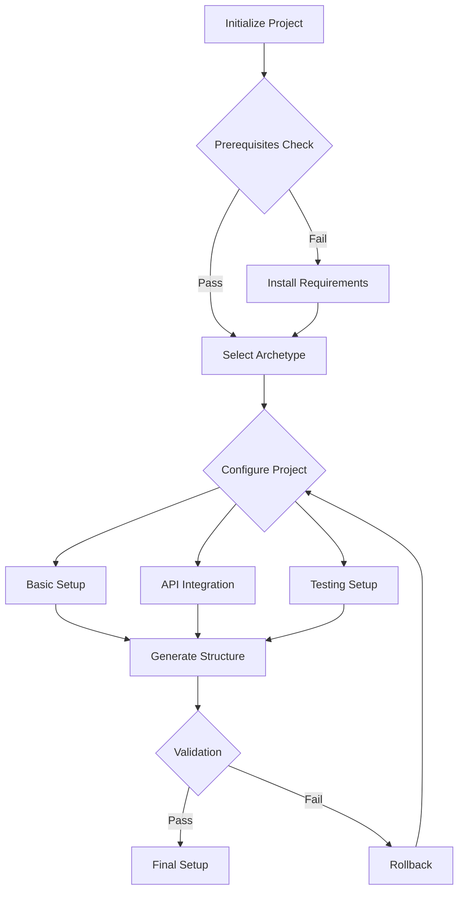

# 🚀 Genesis Protocol Developer Kit

A revolutionary AI-enhanced toolkit for modern software development, combining intelligent project initialization, multi-agent orchestration, and best practices automation.

## 🌟 Overview

The Genesis Protocol Developer Kit is a next-generation development toolkit that transforms project initialization and management through:

- 🤖 **AI-driven project profiling** for tailored architecture recommendations
- 🛠️ **Smart tech stack selection** with dynamic suggestions
- 📁 **Automated project scaffolding** for streamlined workflows
- 📜 **Best practices automation** across the development lifecycle
- 🎭 **Character creation system** for archetype-driven project alignment

---

## 🎯 Key Features

### **1. Enhanced Character Creation System**

- 🎭 Archetype-specific prompts for personalized project design
- 👤 User preference profiling with interactive CLI
- 🌐 Integration with external AI services (e.g., OpenAI, Hugging Face)
- 🔑 Automated API key management
- 📦 Contextual technology recommendations
- 🛡️ Emoji-enhanced feedback for intuitive navigation

### **2. Comprehensive Tech Stack Integration**

- ⚙️ ML/AI frameworks: TensorFlow, PyTorch, LangChain
- 🌐 External APIs: Hugging Face, OpenAI, Eleven Labs
- ☁️ Cloud-native technologies: AWS, GCP, Azure
- 🔍 Monitoring and observability solutions
- 🛠️ Modern development tools and CI/CD pipelines

### **3. Project Archetypes with Smart Templates**

#### **Alchemist Class**: Experimental ML/AI Research Focus

```plaintext
alchemist_project/
├── experiments/      # Research and experimentation lab
├── research/         # Documentation and findings
├── synthesis/        # Integration and transformation
├── notebooks/        # Jupyter notebooks
└── models/           # Trained models and artifacts
```

#### **Sentinel Class**: Security and Performance Focus

```plaintext
sentinel_project/
├── security/         # Security configurations and policies
├── performance/      # Performance optimizations
├── monitoring/       # System monitoring and alerts
├── tests/           # Security and load tests
└── compliance/      # Security compliance and auditing
```

#### **Oracle Class**: Data Analytics and Insights Focus

```plaintext
oracle_project/
├── knowledge_base/   # Core knowledge repository
├── analytics/        # Data analysis engines
├── insights/         # Generated insights and predictions
├── vectors/         # Vector embeddings and indexes
└── agents/          # AI agents and processors
```

#### **Engineer Class**: System Architecture Focus

```plaintext
engineer_project/
├── architecture/     # System architecture blueprints
├── components/       # Reusable system components
├── infrastructure/   # Infrastructure as code
├── workflows/        # CI/CD and automation
└── docs/            # Technical documentation
```

### Additional Specialized Classes

#### **Innovator Class**: Cutting-Edge Tech Focus

```plaintext
innovator_project/
├── prototypes/       # Proof of concepts
├── labs/            # Innovation workspace
├── research/        # Technical research
├── benchmarks/      # Performance metrics
└── showcase/        # Demo environments
```

#### **Lorekeeper Class**: Knowledge Management Focus

```plaintext
lorekeeper_project/
├── archives/        # Information archives
├── indices/         # Search and retrieval systems
├── taxonomies/      # Classification systems
├── interfaces/      # Access and query layers
└── visualizations/  # Knowledge visualization
```

Each archetype comes with:

- 🎯 Specialized project templates
- 🛠️ Pre-configured tool chains
- 📚 Best practices documentation
- 🤖 AI-assisted setup guidance
- 🔧 Custom workflow automation

### **4. Automated Setup & Configuration**

- 🚀 Project scaffolding with rollback capability
- 🌱 Intelligent environment configuration
- 📦 Dependency management automation
- 📖 Dynamic documentation generation
- ⚙️ CI/CD pipeline setup
- 🧩 Prerequisite checking system

---

## 🚀 Getting Started

### **Prerequisites**

- Python 3.8+
- Git
- Virtual Environment (recommended)

### **Installation**

#### 1. **Clone the Repository**

```bash
git clone https://github.com/Hams-Ollo/Genesis-Protocol-Developer-Kit.git
cd "Genesis Protocol Developer Kit"
```

#### 2. **Create Virtual Environment**

```bash
python -m venv venv
source venv/bin/activate  # On Windows: .\venv\Scripts\activate
```

#### 3. **Install Dependencies**

```bash
pip install -r requirements.txt
```

#### 4. **Run the Environment Setup Script**

```bash
python genesis_setup.py
```

- This step installs the core and optional dependencies.
- Sets up the development environment with Git hooks and configurations.

#### 5. **Run the Project Initializer**

```bash
python initialize_project.py
```

- This step guides you through creating a project structure tailored to your needs.

---

### **Creating a New Project**

#### 1. **Run the Project Initializer**

```bash
python initialize_project.py
```

#### 2. **Follow the Interactive Setup**

- Answer project profiling questions.
- Select desired technologies.
- Configure project settings.
- Review and confirm generation.

---

## 🛠 Examples & Use Cases

### **AI Development Project**

```bash
# Example initialization
python initialize_project.py --archetype alchemist --focus ai
# Generates AI-focused structure with ML pipeline setup
```

### **Security-Focused API**

```bash
# Example initialization
python initialize_project.py --archetype sentinel --focus api
# Generates security-hardened API structure
```

### **Knowledge Management System**

```bash
# Example initialization
python initialize_project.py --archetype oracle --focus knowledge
# Generates knowledge base structure with search capabilities
```

---

## ❓ Frequently Asked Questions

### **Setup Issues**

1. **Q: Why am I getting Python version errors?**
   - A: The kit requires Python 3.8+. Check your version with `python --version`

2. **Q: How do I handle API key configuration?**
   - A: Use the `.env.example` template and create a `.env` file with your keys

3. **Q: Can I change the archetype after initialization?**
   - A: Yes, use `python initialize_project.py --reconfigure`

### **Common Operations**

1. **Q: How do I update the kit?**

   ```bash
   git pull origin main
   pip install -r requirements.txt
   ```

2. **Q: How do I add new dependencies?**
   - Edit `requirements.txt` and run `pip install -r requirements.txt`

---

## 🔄 Workflow Visualization



---

## 📈 Roadmap

### **Q1-Q2 2025**

- 🎭 Enhanced character creation system
- 🌐 External API integration framework
- 🧪 Automated testing setup
- 🔄 Rollback mechanism implementation

### **Q3-Q4 2025**

- 🤖 Advanced AI agent integration
- 📊 Multi-modal project support
- 🔒 Enhanced security features
- ⚡ Performance optimization tools

---

## 📚 Documentation

### **Project Types**

1. **AI/ML Applications**
   - Model development structure
   - Experiment tracking
   - Data pipeline setup
   - Model serving configuration

2. **Web Applications**
   - Frontend scaffolding
   - API structure
   - Database integration
   - Authentication setup

3. **Knowledge Management Systems**
   - Content organization
   - Search integration
   - Version control
   - Access management

### **Framework Selection**

- 📦 Contextual recommendations
- 🛠️ Best practices integration
- ⚙️ Compatibility checking
- ⚡ Performance considerations

---

## 🤝 Community & Support

### **Getting Help**

- 🐛 Create an issue for bugs
- 💬 Join community discussions
- 📖 Check the documentation
- 📧 Contact the support team

### **Contributing**

1. Fork the repository
2. Create your feature branch
3. Implement your changes
4. Submit a pull request

---

## 📄 License

This project is licensed under the MIT License - see the LICENSE file for details.

## 🙏 Acknowledgments

- ❤️ Open source community
- ✨ Contributors and maintainers
- 🚀 Early adopters and testers
- 🔧 Framework and tool creators

---

Made with ❤️ by the Genesis Protocol Team
